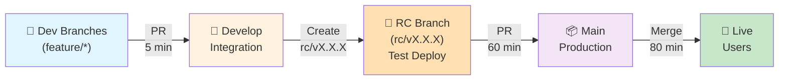

# CI/CD Documentation - Smart Pocket

**Complete guide** for the RC (Release Candidate) branching strategy and CI/CD workflows in Smart Pocket.

---

## 📋 Table of Contents

1. [Quick Overview](#quick-overview)
2. [The RC Strategy](#the-rc-strategy)
3. [Branch Structure](#branch-structure)
4. [Workflow Stages](#workflow-stages)
5. [Version Management](#version-management)
6. [Docker Tagging Strategy](#docker-tagging-strategy)
7. [Actions Credit Analysis](#actions-credit-analysis)
8. [Branch Protection Rules](#branch-protection-rules)
9. [Troubleshooting](#troubleshooting)

---

## Quick Overview

**Problem**: 
- Building on every push (main + develop) costs ~1000+ Actions minutes/month
- Need test deployments before production
- Solo developer needs discipline to prevent accidental releases

**Solution**: 
**RC (Release Candidate) Strategy with Test Deployments**

```
Any Branch → Develop → rc/vX.X.X → Main
            (code)    (test)      (prod)
```

**Benefits**:
- ✅ Test deployments on RC branches (Docker 'qa', TestFlight/beta)
- ✅ Strict enforcement: Only rc/* branches can merge to main
- ✅ Synchronized versions: Backend & mobile always same version
- ✅ ~82% Actions credit savings
- ✅ Clear, linear workflow

---

## The RC Strategy

### Workflow Diagram



### Key Characteristics

1. **Single Version Number**
   - Backend and mobile always at same version
   - Enforced by CI checks
   - Example: v1.0.5 for both

2. **Test Deployments on RC**
   - Backend: Docker image tagged 'qa'
   - Mobile: TestFlight beta track
   - Allows testing before production

3. **Strict Main Branch**
   - ONLY rc/* branches can merge to main
   - Enforced by branch protection + CI
   - Prevents accidental releases

4. **Auto-Cleanup**
   - RC branches automatically deleted after merge
   - Clean git history
   - No manual branch management

---

## Branch Structure

### Branch Naming & Rules

```
main              ← Production (stable, auto-deploys)
develop           ← Integration (active development)
rc/v1.0.5         ← Release Candidate (testing, test deploy)
rc/v1.0.6         ← Release Candidate (testing, test deploy)
feature/auth      ← Feature branch (short-lived, lightweight checks)
feature/payment   ← Feature branch (short-lived, lightweight checks)
```

### Detailed Branch Rules

| Branch | Source | Destination | Checks | Deployment | Delete |
|--------|--------|-------------|--------|------------|--------|
| **feature/*** | N/A | develop | Lint, TypeScript, prebuild (~5 min) | None | Manual |
| **develop** | feature/* | N/A | None | None | Never |
| **rc/vX.X.X** | develop | main | Full build, version validation (~60 min) | Test (qa tag) | Auto |
| **main** | rc/* only | N/A | Enforcement, version check (~5 min) | Production (latest) | N/A |

### Merge Direction

```
✅ feature/foo → develop       (encouraged)
✅ rc/vX.X.X → main           (only allowed source)
❌ develop → main             (not allowed)
❌ feature/* → main           (not allowed)
❌ main → anywhere            (never merge FROM main)
```

---

## Workflow Stages

### Stage 1: Feature Development

```yaml
Trigger: PR to develop
Runs On: Every feature branch push
Time: ~5-10 minutes per PR
Cost: Low
Checks:
  ✅ Lint (ESLint + Prettier)
  ✅ TypeScript compilation
  ✅ Mobile prebuild (Expo)
  ✅ Conventional commit validation
Deployment: None
```

**Daily Workflow**:
```bash
git checkout -b feature/my-feature develop
# ... make changes ...
git push origin feature/my-feature
# Create PR to develop
# → Lightweight checks run (~5 min)
# → Code review
# → Merge to develop
```

---

### Stage 2: RC (Release Candidate) Testing

```yaml
Trigger: Push to rc/vX.X.X branch
Time: ~60 minutes
Cost: Medium (intentional release)
Builds:
  ✅ Backend: Full Docker build
  ✅ Mobile: Full build (Android + iOS)
Deployment:
  ✅ Backend: Docker image tagged 'qa' (test environment)
  ✅ Mobile: TestFlight beta track (beta testers)
Tests:
  ✅ Run if configured
Cleanup: None (branch remains)
```

**When to Create RC**:
```bash
# When ready to test a release
git checkout develop
git pull

# Bump both versions (MUST match)
npm --prefix apps/smart-pocket-backend version patch
npm --prefix apps/smart-pocket-mobile version patch

# Create RC branch
git checkout -b rc/v1.0.5
git push origin rc/v1.0.5

# → Full builds trigger (~60 min)
# → Test in beta environments
```

**Testing Phase**:
- Test in TestFlight beta (manual, no time limit)
- Test backend on 'qa' Docker tag
- Find bugs? Create new rc/vX.X.X and retry
- All passing? Proceed to production

---

### Stage 3: Production Release

```yaml
Trigger: Merge rc/vX.X.X → main (PR merge)
PR Checks Time: ~5 minutes
Deployment Time: ~80 minutes
Cost: High (but only for production)
Enforcements:
  ✅ PR source MUST be rc/* branch
  ✅ Version MUST increase
  ✅ Both apps at same version
Deployments:
  ✅ Backend Docker: 'latest' + 'vX.X.X' tags
  ✅ Mobile: Google Play production
  ✅ Mobile: App Store production
Artifacts:
  ✅ GitHub Release created
  ✅ Release notes generated
Cleanup:
  ✅ RC branch auto-deleted
  ✅ Clean git history
```

**Production Release Workflow**:
```bash
# Create PR: rc/v1.0.5 → main
gh pr create --base main --head rc/v1.0.5

# → Enforcement checks run (~5 min)
# → Verify version increase
# → Merge PR

# → Production deployment starts (~80 min)
# → Backend Docker: latest + v1.0.5 tags
# → Mobile: Production stores
# → GitHub Release created
# → RC branch auto-deleted
```

---

## Version Management

### Synchronized Versioning

**Rule**: Backend and mobile MUST always be at the same version.

```json
apps/smart-pocket-backend/package.json
{
  "version": "1.0.5"
}

apps/smart-pocket-mobile/package.json
{
  "version": "1.0.5"
}
```

### Semantic Versioning

```
MAJOR.MINOR.PATCH
  1  .  0  .  5

Changes:
  - PATCH (bug fixes):    1.0.5 → 1.0.6  (npm version patch)
  - MINOR (features):     1.0.5 → 1.1.0  (npm version minor)
  - MAJOR (breaking):     1.0.5 → 2.0.0  (npm version major)
```

### Version Update Commands

```bash
# Patch (bug fixes)
npm --prefix apps/smart-pocket-backend version patch
npm --prefix apps/smart-pocket-mobile version patch

# Minor (new features)
npm --prefix apps/smart-pocket-backend version minor
npm --prefix apps/smart-pocket-mobile version minor

# Major (breaking changes)
npm --prefix apps/smart-pocket-backend version major
npm --prefix apps/smart-pocket-mobile version major
```

### Version Validation (Enforced by CI)

1. **RC Branch Name Matches Version**
   ```
   Branch: rc/v1.0.5
   Backend package.json: "1.0.5" ✓
   Mobile package.json: "1.0.5" ✓
   ```

2. **Main PR Must Increase Version**
   ```
   Current main: v1.0.4
   RC being merged: v1.0.5 ✓ (increased)
   Prevents downgrades or staying same
   ```

3. **Both Apps Stay In Sync**
   ```
   Backend: v1.0.5 ✓
   Mobile: v1.0.5 ✓
   Never allowed to differ
   ```

---

## Docker Tagging Strategy

### Test Deployment (RC)

```bash
# RC builds create 'qa' tag for testing
docker tag smart-pocket-backend:rc-1.0.5 smart-pocket-backend:qa

# Allows:
# - Testing in staging environment
# - Keeping previous production version live
# - Rolling back if needed
```

### Production Deployment (Main)

```bash
# Production builds create multiple tags
docker tag smart-pocket-backend:1.0.5 smart-pocket-backend:latest
docker tag smart-pocket-backend:1.0.5 smart-pocket-backend:v1.0.5

# Tags serve:
# latest   → Always current production
# v1.0.5   → Can rollback to specific version
# 1.0.5    → Alternative version tag
```

### Docker Registry Strategy

```
Old Version (v1.0.4):
  - Still available by tag: v1.0.4, 1.0.4
  - Can be deployed again if rollback needed
  - Not replaced by new 'latest'

Current Version (v1.0.5):
  - Tagged as: latest, v1.0.5, 1.0.5
  - Running in production
  - Available for rollback

New RC (rc-1.0.6):
  - Tagged as: qa, rc-1.0.6
  - Running in test environment
  - Being validated before promotion
```

---

## Actions Credit Analysis

### Monthly Cost Breakdown (1 Release Per Week)

```
Feature PRs (8/week × 5 min):
  8 PRs × 5 min = 40 minutes

RC Builds (1/week × 60 min):
  1 RC × 60 min = 60 minutes

PR to Main Checks (1/week × 5 min):
  1 PR × 5 min = 5 minutes

Production Deploys (1/week × 80 min):
  1 Deploy × 80 min = 80 minutes

─────────────────────────────
Total: ~185 minutes/month

Savings vs Current:
  Current setup: ~1000 min/month (build on every push)
  New setup: ~185 min/month
  Savings: ~82% reduction!
```

### Cost by Workflow Stage

| Stage | Duration | Frequency | Monthly | Why |
|-------|----------|-----------|---------|-----|
| Feature PR checks | 5 min | 8x/week | ~40 min | Lightweight: lint + build |
| RC build/deploy | 60 min | 1x/week | ~60 min | Full builds, test deploy |
| PR to main checks | 5 min | 1x/week | ~5 min | Enforcement only |
| Production deploy | 80 min | 1x/week | ~80 min | Full builds, prod deploy |
| **Monthly Total** | — | — | **~185 min** | **82% savings!** |

### Comparison Table

| Scenario | Minutes/Month | vs Recommended |
|----------|---------------|----------------|
| Current (build on every push) | ~1000+ | +440% |
| Recommended (RC strategy) | ~185 | — |
| Minimal (no tests) | ~80 | -57% |
| Maximum (extensive tests) | ~300 | +62% |

---

## Branch Protection Rules

### `main` Branch Protection

```yaml
Rule Name: "Enforce RC-only releases"
Applies To: main

Protections:
  Require Pull Request Before Merging:
    Required Approving Reviews: 0  (solo dev, can enable later)
    Dismiss Stale PR Approvals: N/A
    
  Required Status Checks:
    ✓ pr-base-checks (enforce rc/* only)
    ✓ pr-main-build (full builds pass)
    ✓ version-check (version increases)
    Require Branches Up to Date: Yes
    
  Restrictions:
    Allow Force Pushes: No
    Allow Deletions: No
    Include Administrators: No
```

### `develop` Branch Protection

```yaml
Rule Name: "Enforce feature branch workflow"
Applies To: develop

Protections:
  Require Pull Request Before Merging:
    Required Approving Reviews: 0  (solo dev, can enable later)
    
  Required Status Checks:
    ✓ pr-develop-checks (lint, build, test)
    Require Branches Up to Date: No
    
  Restrictions:
    Allow Deletions: No
    Include Administrators: No
```

### GitHub UI Setup

1. Go to: Settings → Branches → Branch Protection Rules
2. For `main`: Create new rule with enforcements above
3. For `develop`: Create new rule with enforcements above
4. Save and test

---

## Troubleshooting

### Issue: Version Mismatch on RC Branch

**Problem**: Pushed to rc/v1.0.5 but CI reports version mismatch

**Root Cause**: 
- package.json version doesn't match branch name
- Backend and mobile at different versions

**Solution**:
```bash
# 1. Check current versions
echo "Backend:" && cat apps/smart-pocket-backend/package.json | grep '"version"'
echo "Mobile:" && cat apps/smart-pocket-mobile/package.json | grep '"version"'

# 2. Update both to match branch name (v1.0.5 → 1.0.5)
npm --prefix apps/smart-pocket-backend version patch
npm --prefix apps/smart-pocket-mobile version patch

# 3. Verify they match
npm --prefix apps/smart-pocket-backend version | grep version
npm --prefix apps/smart-pocket-mobile version | grep version

# 4. Commit and push
git add apps/*/package.json
git commit -m "chore: fix version mismatch for rc/v1.0.5

- Backend: 1.0.5
- Mobile: 1.0.5

Co-authored-by: Copilot <223556219+Copilot@users.noreply.github.com>"
git push origin rc/v1.0.5

# → CI re-runs with correct versions
```

---

### Issue: Accidentally Pushed to Main Instead of RC

**Problem**: Changes went directly to main instead of creating RC first

**Root Cause**: 
- Branch protection not enforced
- Pushed directly instead of creating PR

**Solution**:
```bash
# 1. If branch protection is enabled, this should fail
#    If it didn't fail, enforcement needs setup

# 2. Revert the commit
git revert HEAD
git push origin main

# 3. Follow correct workflow:
#    - Branch from develop
#    - Create rc/vX.X.X
#    - Test
#    - PR to main

# 4. Verify branch protection is enforced
#    Settings → Branches → Branch Protection Rules
```

---

### Issue: RC Testing Found Bugs, Need New RC

**Problem**: Found bugs during beta testing, need to create new RC

**Solution**:
```bash
# 1. Fix bugs on develop
git checkout develop
git pull
# ... make fixes ...
git add .
git commit -m "fix: issue found in RC testing"
git push origin develop

# 2. Bump to new version (PATCH)
npm --prefix apps/smart-pocket-backend version patch
npm --prefix apps/smart-pocket-mobile version patch

# 3. Create new RC branch
git checkout -b rc/v1.0.6
git push origin rc/v1.0.6

# → Full builds + test deploy triggers
# → Test new RC in beta
# → If good, PR to main
```

---

### Issue: Version in package.json Doesn't Match Across Apps

**Problem**: Backend is 1.0.5 but mobile is 1.0.4

**Solution**:
```bash
# 1. Identify which is correct
grep '"version"' apps/smart-pocket-backend/package.json
grep '"version"' apps/smart-pocket-mobile/package.json

# 2. Use higher version as target
# If backend is 1.0.5 and mobile is 1.0.4, use 1.0.5

# 3. Update the lower one
npm --prefix apps/smart-pocket-mobile version 1.0.5

# 4. Verify both match
grep '"version"' apps/smart-pocket-backend/package.json
grep '"version"' apps/smart-pocket-mobile/package.json

# 5. Commit to develop
git add apps/*/package.json
git commit -m "chore: sync app versions to 1.0.5"
git push origin develop
```

---

### Issue: Actions Running Unexpectedly

**Problem**: Feature PR triggered expensive builds when they should be lightweight

**Solution**:
```yaml
# Check workflow configuration in .github/workflows/
# Ensure jobs have proper conditions:

jobs:
  develop-checks:
    if: github.base_ref == 'develop'  # Only on develop PRs
    runs-on: ubuntu-latest
    
  main-build:
    if: github.base_ref == 'main'  # Only on main PRs
    runs-on: ubuntu-latest
    
  # Also check path filters:
  on:
    push:
      branches: [develop]
      paths:
        - 'apps/**'          # Only if apps changed
        - '.github/workflows/**'
```

---

## Quick Reference

### Daily Commands

```bash
# Feature Development
git checkout -b feature/my-feature develop
git push origin feature/my-feature
# Create PR to develop

# Release Candidate
npm --prefix apps/smart-pocket-backend version patch
npm --prefix apps/smart-pocket-mobile version patch
git checkout -b rc/v1.0.5
git push origin rc/v1.0.5
# Test in beta environments

# Production Release
gh pr create --base main --head rc/v1.0.5
# After review/approval:
# Merge PR → Production deployment triggers
```

### Version Checking

```bash
# Check both versions
grep '"version"' apps/smart-pocket-backend/package.json
grep '"version"' apps/smart-pocket-mobile/package.json

# Ensure they match before RC
```

### Docker Tags Reference

```bash
# Test environment
docker pull registry/smart-pocket-backend:qa

# Production (current)
docker pull registry/smart-pocket-backend:latest
docker pull registry/smart-pocket-backend:v1.0.5

# Previous versions
docker pull registry/smart-pocket-backend:v1.0.4
docker pull registry/smart-pocket-backend:v1.0.3
```

---

## Related Documentation

- **Quick Guide**: See `./AGENTS.md` for AI agent reference
- **Backend**: See `../apps/smart-pocket-backend/AGENTS.md`
- **Mobile**: See `../apps/smart-pocket-mobile/AGENTS.md`
- **Docker**: See `../docker/DOCKER_GUIDE.md`
- **Root Guide**: See `../AGENTS.md`

---

## Summary

The RC (Release Candidate) strategy provides:

1. **Clear Workflow**: Feature → Develop → RC (test) → Main (prod)
2. **Cost Savings**: 82% reduction in Actions minutes
3. **Quality Gates**: Test deployments before production
4. **Enforced Discipline**: Only rc/* branches merge to main
5. **Version Sync**: Backend & mobile always same version
6. **Automation**: Auto-cleanup, auto-deployment, auto-releases

This is a proven pattern used by major software projects and is perfectly suited for Smart Pocket's monorepo setup.

---

**Last Updated**: 2026-03-29  
**Status**: Active CI/CD Strategy  
**Maintained By**: Smart Pocket Team
