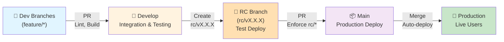

# CI/CD Workflow Documentation

> **Purpose**: Document the RC (Release Candidate) branching strategy and release workflows for the Smart Pocket monorepo.
>
> **Context**: Smart Pocket is a monorepo containing both a React Native mobile app (@apps/smart-pocket-mobile/) and an Express.js backend (@apps/smart-pocket-backend/). This workflow provides coordinated versioning and quality checks while minimizing GitHub Actions credits.

---

## 📋 Table of Contents

1. [Current State](#current-state)
2. [Final Workflow: RC Strategy](#final-workflow-rc-strategy)
3. [Why This Approach](#why-this-approach)
4. [Branch Structure](#branch-structure)
5. [Workflow Stages](#workflow-stages)
6. [Version Management](#version-management)
7. [Docker Tagging Strategy](#docker-tagging-strategy)
8. [Actions Credit Optimization](#actions-credit-optimization)
9. [Implementation Details](#implementation-details)
10. [Branch Protection Rules](#branch-protection-rules)
11. [Troubleshooting](#troubleshooting)

---

## 🔍 Current State

### Existing Branches
```
main      ← Production releases
develop   ← Integration branch (primary development)
mobile    ← Mobile-specific development
backend   ← Backend-specific development
ci-checks ← CI/CD workflow testing
```

### Current Workflows
- ✅ `pr-base-checks.yml` - Enforces PRs to `main` must come from `develop`
- ✅ `pr-conventional-commits.yml` - Validates commit messages
- ✅ `pr-mobile-build-checks.yml` - Builds mobile app on PR
- ✅ `deploy-backend.yml` - Builds and pushes backend Docker image on push to `main`/`develop`
- ✅ `deploy-android.yml` - Builds Android APK/AAB
- ✅ `deploy-ios.yml` - Builds iOS IPA

### Credit Usage Patterns
- **PR Checks**: Run on every PR (small cost)
- **Build & Deploy**: Runs on every push to `main`/`develop` (high cost - Docker builds)
- **Mobile Builds**: APK/AAB builds are expensive (30+ minutes per build)

---

## 🎯 Final Workflow: RC Strategy

### **RC (Release Candidate) Strategy with Test Deployments**

```
[any branch] → develop → rc/vX.Y.Z → main
```



**Key Characteristics:**
- ✅ Single version for entire project (backend + mobile)
- ✅ RC branches for test deployments (not just builds)
- ✅ Test environments: Docker 'qa' tag, TestFlight/beta track
- ✅ Only rc/* branches can merge to main (strictly enforced)
- ✅ Production with Docker 'latest' + version tags
- ✅ RC branches auto-delete after merge
- ✅ Minimal Actions credits (~70-80% savings)
- ✅ Clear, linear workflow

---

## Why This Approach

### For Your Solo Development Situation

1. **Test Before Production**
   - RC branch deploys to testing environments
   - You can test in beta/TestFlight before production
   - Catch bugs before live release

2. **Enforced Discipline**
   - ONLY rc/* branches can go to main
   - No accidental releases from develop or features
   - Version validation on every PR

3. **Cost Efficient**
   - Only expensive builds on RC and main
   - Feature PRs use lightweight checks (~5 min)
   - ~300 min/month vs ~1000 min/month

4. **Clear Semantics**
   - RC = Release Candidate (industry standard term)
   - Not just "QA" - actual test deployment happens
   - Matches major software release processes

5. **Automated Cleanup**
   - RC branches auto-delete after merge
   - Clean git history
   - No manual branch management

---

## Branch Structure

```
main              ← Production (stable, auto-deploys to prod)
develop           ← Integration (active development)
rc/v1.0.5         ← Release Candidate (testing, auto-deploys to test)
rc/v1.0.6         ← Release Candidate (testing, auto-deploys to test)
...
feature/auth      ← Feature branch (short-lived, lightweight checks)
feature/payment   ← Feature branch (short-lived, lightweight checks)
```

### Branch Rules

| Branch | Source | Destination | Checks | Deployment | Delete |
|--------|--------|-------------|--------|------------|--------|
| feature/* | N/A | develop | Lightweight (~5 min) | None | Manual |
| develop | feature/* | N/A | None | None | Never |
| rc/vX.X.X | develop | main | Full + version (~60 min) | Test (qa tag) | Auto |
| main | rc/* only | N/A | Enforcement + version (~5 min) | Production (latest) | N/A |

---

## Workflow Stages

### Stage 1: Feature Development
```
PR to develop:
✅ Lint + TypeScript build
✅ Mobile prebuild
✅ Conventional commit validation
⏱️ Time: ~5-10 minutes per PR
💰 Cost: Low
```

### Stage 2: RC (Release Candidate) Testing
```
Push to rc/vX.X.X:
✅ Extract version from branch
✅ Validate both apps at same version
✅ Full backend build + Docker 'qa' tag
✅ Full mobile build + deploy to TestFlight/beta
✅ Run tests (if configured)
⏱️ Time: ~60 minutes
💰 Cost: Medium (but only when intentional release)
🧪 Deployment: Testing environments only
```

### Stage 3: Manual Testing Phase
```
Test in beta/TestFlight environments:
🧪 Manual testing with no time limit
🐛 Find bugs? Create new rc/vX.X.X and try again
✅ Testing passed? Proceed to main
⏱️ Time: Hours/days (as needed)
💰 Cost: $0 (no Actions run)
```

### Stage 4: Production Release
```
PR rc/vX.X.X to main:
✅ Enforce: source MUST be rc/* branch
✅ Enforce: version must increase
✅ Enforce: both apps at same version
✅ Merge to main

Main merge triggers:
🚀 Backend Docker: 'latest' + 'vX.X.X' tags
🚀 Mobile: Google Play + App Store production
✅ GitHub Release created
✅ RC branch auto-deleted
⏱️ Time: ~80 minutes
💰 Cost: High (but only for production)
🚀 Deployment: Production (live users)
```

---

## Version Management

### Synchronized Versioning
```
Both at same version always:

apps/smart-pocket-backend/package.json
  "version": "1.0.5"

apps/smart-pocket-mobile/package.json
  "version": "1.0.5"
```

### Semantic Versioning
```
MAJOR.MINOR.PATCH
  1  .  0  .  5

PATCH (bug fixes):    npm --prefix apps/smart-pocket-backend version patch
                      1.0.5 → 1.0.6

MINOR (features):     npm version minor
                      1.0.5 → 1.1.0

MAJOR (breaking):     npm version major
                      1.0.5 → 2.0.0
```

### Version Validation Rules (Enforced by CI)

1. **RC branch must match version**
   - Branch: rc/v1.0.5
   - Both package.json: "1.0.5"
   - CI validates this ✓

2. **Main PRs must increase version**
   - Main current: v1.0.4
   - RC being merged: v1.0.5
   - Prevents downgrades ✓

3. **Both apps stay in sync**
   - Backend: v1.0.5
   - Mobile: v1.0.5
   - Always equal ✓

---

## Docker Tagging Strategy

```
RC Testing Deployment:
  docker tag <image>:qa        # Temporary, testing use
  docker tag <image>:rc-1.0.5  # For reference

Production Deployment:
  docker tag <image>:latest    # Always points to current release
  docker tag <image>:v1.0.5    # Version-specific tag
  docker tag <image>:1.0.5     # Also version tag
  
Example workflow:
  Merge rc/v1.0.5 to main
  → docker build ... -t backend:latest -t backend:v1.0.5
  → push to registry
  → Old 'latest' still available by version tag if needed to rollback
```

---

## Actions Credit Optimization

### Monthly Cost Breakdown (1 RC per week)

```
Feature PRs (8/week × 5 min):
  ~40 minutes

RC builds (1/week × 60 min):
  ~60 minutes

PR to main checks (1/week × 5 min):
  ~5 minutes

Production deploys (1/week × 80 min):
  ~80 minutes

Total: ~185 minutes/month

Savings vs current:
  Current: ~1000 min/month
  New: ~185 min/month
  Savings: ~82% reduction!
```

### Cost by Workflow Stage

| Stage | Time | Frequency | Monthly | Why |
|-------|------|-----------|---------|-----|
| Feature PR checks | 5 min | 8x/week | ~40 min | Lightweight only |
| RC build/deploy | 60 min | 1x/week | ~60 min | Full builds, test deploy |
| PR to main checks | 5 min | 1x/week | ~5 min | Enforcement only |
| Production deploy | 80 min | 1x/week | ~80 min | Full builds, prod deploy |
| **Monthly Total** | — | — | **~185 min** | 82% savings! |

---

## Implementation Details

See **CI_CD_IMPLEMENTATION_ROADMAP.md** for:
- 7 implementation phases (Prep → Deployment → Optimization)
- Complete workflow YAML files (4 workflows)
- Version synchronization steps
- Branch protection rule setup
- Testing procedures
- Troubleshooting guide

---

## Branch Protection Rules

### `main` Branch Protection
```yaml
- Require pull request reviews: 0 (solo dev, but can enable)
- Require status checks to pass:
  - pr-main-checks (enforce rc/* only)
  - version-check (validate version increase)
- Require branches to be up to date: Yes
- Require code reviews from code owners: No
- Dismiss stale pull request approvals: N/A
- Require approval of the most recent reviewable push: N/A
- Include administrators: No
- Restrict who can push to matching branches: No
- Allow force pushes: No
- Allow deletions: No
```

### `develop` Branch Protection
```yaml
- Require pull request reviews: 0 (solo dev, but can enable)
- Require status checks to pass:
  - pr-develop-checks (lint, build, test)
- Require branches to be up to date: No
- Include administrators: No
- Allow deletions: No
```

---

## Troubleshooting

### I pushed to rc/v1.0.5 but tests show version mismatch

**Problem**: Package.json version doesn't match branch name

**Solution**:
```bash
# Check current version
cat apps/smart-pocket-backend/package.json | grep version
cat apps/smart-pocket-mobile/package.json | grep version

# Update if needed
npm --prefix apps/smart-pocket-backend version patch
npm --prefix apps/smart-pocket-mobile version patch

# Commit and push
git add .
git commit -m "chore: update version for rc/v1.0.5"
git push
```

### I want to retry RC testing with a newer version

**Problem**: RC test failed, need to try again

**Solution**:
```bash
# Bump version
npm --prefix apps/smart-pocket-backend version patch
npm --prefix apps/smart-pocket-mobile version patch

# Create new RC branch
git checkout develop
git pull
git checkout -b rc/v1.0.6

# Push and repeat testing
git push origin rc/v1.0.6
```

### I accidentally pushed to main instead of rc/*

**Problem**: Pushed directly to main (should only accept rc/* PRs)

**Solution**:
1. This should be blocked by CI if branch protection is enabled
2. If it wasn't blocked, revert the commit:
```bash
git revert HEAD
git push origin main
```

### Version in package.json doesn't match across apps

**Problem**: Backend is 1.0.5 but mobile is 1.0.4

**Solution**:
```bash
# List all versions
echo "Backend:" && grep version apps/smart-pocket-backend/package.json
echo "Mobile:" && grep version apps/smart-pocket-mobile/package.json

# Update to match (use higher version)
npm --prefix apps/smart-pocket-mobile version 1.0.5

# Commit and push to develop
git add .
git commit -m "chore: sync versions"
git push origin develop
```

---

## Quick Reference

### Daily Workflow

```bash
# 1. Create feature branch from develop
git checkout -b feature/my-feature develop

# 2. Make changes, commit
git add .
git commit -m "feat: add new feature"

# 3. Push and create PR to develop
git push origin feature/my-feature
# → Lightweight checks run (~5 min)

# 4. Once merged to develop, when ready to release:
git checkout develop
git pull

# 5. Bump both versions
npm --prefix apps/smart-pocket-backend version patch
npm --prefix apps/smart-pocket-mobile version patch

# 6. Create RC branch
git checkout -b rc/v1.0.5
git push origin rc/v1.0.5
# → Full builds + test deploy (~60 min)

# 7. Test in TestFlight/beta

# 8. If good, create PR to main
# → Enforcement checks run (~5 min)

# 9. Merge PR
# → Production deploy (~80 min)
# → RC branch auto-deleted
```

---

**Last Updated**: 2026-03-28  
**Status**: Final, Production Ready  
**Next Step**: See CI_CD_IMPLEMENTATION_ROADMAP.md for implementation
