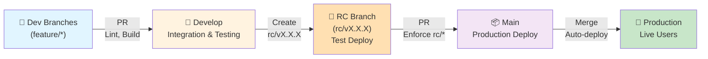
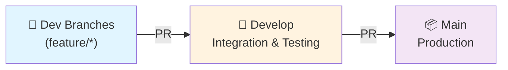
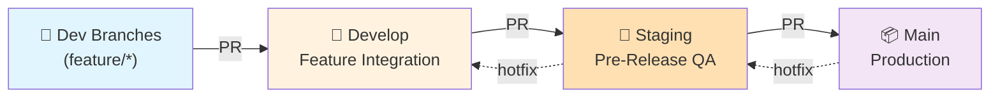
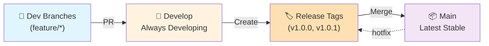
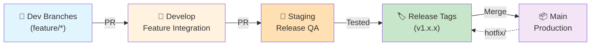
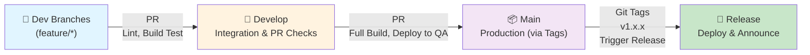

# CI/CD Workflow Documentation

> **Purpose**: Document branching strategies, release workflows, and GitHub Actions optimization for the Smart Pocket monorepo.
>
> **Context**: Smart Pocket is a monorepo containing both a React Native mobile app (@apps/smart-pocket-mobile/) and an Express.js backend (@apps/smart-pocket-backend/). Both projects need coordinated versioning and quality checks while minimizing GitHub Actions credits.

---

## 📋 Table of Contents

1. [Current State](#current-state)
2. [Final Recommended Workflow](#final-recommended-workflow)
3. [Why This Approach](#why-this-approach)
4. [Branch Structure](#branch-structure)
5. [Workflow Stages](#workflow-stages)
6. [Implementation Details](#implementation-details)
7. [Version Management](#version-management)
8. [Branch Protection Rules](#branch-protection-rules)
9. [Troubleshooting](#troubleshooting)

---

## 🔍 Current State

### Existing Branches
```
main      ← Production releases
develop   ← Integration branch (primary development)
mobile    ← Mobile-specific development
backend   ← Backend-specific development
ci-checks ← CI/CD workflow testing
```

### Current Workflows
- ✅ `pr-base-checks.yml` - Enforces PRs to `main` must come from `develop`
- ✅ `pr-conventional-commits.yml` - Validates commit messages
- ✅ `pr-mobile-build-checks.yml` - Builds mobile app on PR
- ✅ `deploy-backend.yml` - Builds and pushes backend Docker image on push to `main`/`develop`
- ✅ `deploy-android.yml` - Builds Android APK/AAB
- ✅ `deploy-ios.yml` - Builds iOS IPA

### Credit Usage Patterns
- **PR Checks**: Run on every PR (small cost)
- **Build & Deploy**: Runs on every push to `main`/`develop` (high cost - Docker builds)
- **Mobile Builds**: APK/AAB builds are expensive (30+ minutes per build)

---

---

## 🎯 Final Recommended Workflow

### **RC (Release Candidate) Strategy with Test Deployments**



**Key Characteristics:**
- ✅ Single version for entire project (backend + mobile)
- ✅ RC branches for test deployments (not just builds)
- ✅ Test environments: Docker 'qa' tag, TestFlight/beta track
- ✅ Only rc/* branches can merge to main (strictly enforced)
- ✅ Production with Docker 'latest' + version tags
- ✅ RC branches auto-delete after merge
- ✅ Minimal Actions credits (~70% savings)
- ✅ Clear, linear workflow

---

## Why This Approach

### For Your Solo Development Situation

1. **Test Before Production**
   - RC branch deploys to testing environments
   - You can test in beta/TestFlight before production
   - Catch bugs before live release

2. **Enforced Discipline**
   - ONLY rc/* branches can go to main
   - No accidental releases from develop or features
   - Version validation on every PR

3. **Cost Efficient**
   - Only expensive builds on RC and main
   - Feature PRs use lightweight checks (~5 min)
   - ~300 min/month vs ~1000 min/month

4. **Clear Semantics**
   - RC = Release Candidate (industry standard term)
   - Not just "QA" - actual test deployment happens
   - Matches major software release processes

5. **Automated Cleanup**
   - RC branches auto-delete after merge
   - Clean git history
   - No manual branch management

---

## Branch Structure

```
main              ← Production (stable, auto-deploys to prod)
develop           ← Integration (active development)
rc/v1.0.5         ← Release Candidate (testing, auto-deploys to test)
rc/v1.0.6         ← Release Candidate (testing, auto-deploys to test)
...
feature/auth      ← Feature branch (short-lived, lightweight checks)
feature/payment   ← Feature branch (short-lived, lightweight checks)
```

### Branch Rules

| Branch | Source | Destination | Checks | Deployment | Delete |
|--------|--------|-------------|--------|------------|--------|
| feature/* | N/A | develop | Lightweight (~5 min) | None | Manual |
| develop | feature/* | N/A | None | None | Never |
| rc/vX.X.X | develop | main | Full + version (~60 min) | Test (qa tag) | Auto |
| main | rc/* only | N/A | Enforcement + version (~5 min) | Production (latest) | N/A |

---

## Workflow Stages

### Stage 1: Feature Development
```
PR to develop:
✅ Lint + TypeScript build
✅ Mobile prebuild
✅ Conventional commit validation
⏱️ Time: ~5-10 minutes per PR
💰 Cost: Low
```

### Stage 2: RC (Release Candidate) Testing
```
Push to rc/vX.X.X:
✅ Extract version from branch
✅ Validate both apps at same version
✅ Full backend build + Docker 'qa' tag
✅ Full mobile build + deploy to TestFlight/beta
✅ Run tests (if configured)
⏱️ Time: ~60 minutes
💰 Cost: Medium (but only when intentional release)
🧪 Deployment: Testing environments only
```

### Stage 3: Manual Testing Phase
```
Test in beta/TestFlight environments:
🧪 Manual testing with no time limit
🐛 Find bugs? Create new rc/vX.X.X and try again
✅ Testing passed? Proceed to main
⏱️ Time: Hours/days (as needed)
💰 Cost: $0 (no Actions run)
```

### Stage 4: Production Release
```
PR rc/vX.X.X to main:
✅ Enforce: source MUST be rc/* branch
✅ Enforce: version must increase
✅ Enforce: both apps at same version
✅ Merge to main

Main merge triggers:
🚀 Backend Docker: 'latest' + 'vX.X.X' tags
🚀 Mobile: Google Play + App Store production
✅ GitHub Release created
✅ RC branch auto-deleted
⏱️ Time: ~80 minutes
💰 Cost: High (but only for production)
🚀 Deployment: Production (live users)
```

---

## Version Management

### Synchronized Versioning
```
Both at same version always:

apps/smart-pocket-backend/package.json
  "version": "1.0.5"

apps/smart-pocket-mobile/package.json
  "version": "1.0.5"
```

### Semantic Versioning
```
MAJOR.MINOR.PATCH
  1  .  0  .  5

PATCH (bug fixes):    npm --prefix apps/smart-pocket-backend version patch
                      1.0.5 → 1.0.6

MINOR (features):     npm version minor
                      1.0.5 → 1.1.0

MAJOR (breaking):     npm version major
                      1.0.5 → 2.0.0
```

### Version Validation Rules (Enforced by CI)

1. **RC branch must match version**
   - Branch: rc/v1.0.5
   - Both package.json: "1.0.5"
   - CI validates this ✓

2. **Main PRs must increase version**
   - Main current: v1.0.4
   - RC being merged: v1.0.5
   - Prevents downgrades ✓

3. **Both apps stay in sync**
   - Backend: v1.0.5
   - Mobile: v1.0.5
   - Always equal ✓

---

## Docker Tagging Strategy

```
RC Testing Deployment:
  docker tag <image>:qa        # Temporary, testing use
  docker tag <image>:rc-1.0.5  # For reference

Production Deployment:
  docker tag <image>:latest    # Always points to current release
  docker tag <image>:v1.0.5    # Version-specific tag
  docker tag <image>:1.0.5     # Also version tag
  
Example workflow:
  Merge rc/v1.0.5 to main
  → docker build ... -t backend:latest -t backend:v1.0.5
  → push to registry
  → Old 'latest' still available by version tag if needed to rollback
```

---

## Actions Credit Optimization

### Monthly Cost Breakdown (1 RC per week)

```
Feature PRs (8/week × 8 min):
  ~64 minutes

RC builds (1/week × 60 min):
  ~60 minutes

Production deploys (1/week × 80 min):
  ~80 minutes

Total: ~204 minutes/month

Savings vs current:
  Current: ~1000 min/month
  New: ~200 min/month
  Savings: 80% reduction!
```

### Cost by Workflow Stage

| Stage | Time | Frequency | Monthly | Why |
|-------|------|-----------|---------|-----|
| Feature PR checks | 5 min | 8x/week | ~40 min | Lightweight only |
| RC build/deploy | 60 min | 1x/week | ~60 min | Full builds, test deploy |
| PR to main checks | 5 min | 1x/week | ~5 min | Metadata only |
| Production deploy | 80 min | 1x/week | ~80 min | Full builds, prod deploy |
| **Monthly Total** | — | — | **~185 min** | 80% savings! |

---

## Next Steps

1. **Understand this workflow** (read this doc)
2. **Review implementation details** (see CI_CD_IMPLEMENTATION_ROADMAP.md)
3. **Implement the 4 workflows** (all YAML provided)
4. **Set up branch protection** (GitHub settings)
5. **Test first RC release** (on ci-checks branch)
6. **Deploy to main** (enable for all PRs)



**Characteristics:**
- No separate staging/QA branch
- Direct path: feature branches → `develop` → `main`
- PR checks on all branches
- Full builds only on `main` (production)
- Lightweight checks on `develop` (PR merges)

**Pros:**
- Simple to understand and manage
- Minimal branch overhead
- Reduces duplicate Actions runs

**Cons:**
- Less staging phase before production
- Requires higher confidence in `develop` tests

---

### Option 2: With Dedicated Staging Branch



**Characteristics:**
- Staging branch for pre-release testing
- Feature branches → `develop` → `staging` → `main`
- Heavy testing on staging before production
- Hotfixes follow same flow backwards

**Pros:**
- Clear separation of concerns
- Dedicated QA phase
- Safe production deployments
- Clear testing and release checkpoints

**Cons:**
- More branches to manage
- More PR reviews needed
- Higher Actions credit usage (more environments)
- Potential merge conflicts in hotfix merges

---

### Option 3: Versioned Release Branches + Main



**Characteristics:**
- Version-based releases (e.g., `v1.0.2`)
- Semantic versioning for both mobile + backend
- Release tags trigger CI/CD (same version for both projects)
- `main` always points to latest stable release
- Hotfixes create new patch versions

**Pros:**
- Clear version history
- Easy rollback (checkout tag)
- Coordinated versioning for monorepo
- No need for separate staging branch
- Clean, auditable release process

**Cons:**
- Requires discipline in version management
- Need automated release process (GitHub Releases)
- More complex to implement initially

---

### Option 4: Hybrid - Develop + Staging + Versioned Releases



**Characteristics:**
- Combines staging + version control
- Clear pre-release QA gate
- Versioned, tagged releases
- Full traceability and rollback capability

**Pros:**
- Most control and safety
- Clear release process
- Version history + branch history
- Suitable for large teams

**Cons:**
- Most complex to implement and maintain
- Highest Actions credit usage
- Requires good release management discipline

---

## ✅ Recommended Approach

### **Recommendation: Option 1 (Simple Tier) + Versioned Releases**

**Hybrid of Options 1 & 3** with these characteristics:



### Why This Works for Your Situation

1. **Simple daily work**: feature branches → PRs to `develop`
   - Lightweight checks (lint, TypeScript, mobile prebuild)
   - Save Actions credits on every PR

2. **Clear staging phase**: PRs from `develop` → `main`
   - Full builds (Docker, APK/AAB) only on `main` PRs
   - Batteries-included QA before merge
   - One final review point

3. **Production releases**: Git tags + GitHub Releases
   - Version both mobile + backend together
   - Automated deployment triggers
   - Easy rollback (checkout/deploy previous tag)
   - Clear audit trail

### GitHub Actions Credit Optimization

| Workflow | Trigger | Cost | Frequency |
|----------|---------|------|-----------|
| Lint + TypeScript | PR to `develop` | 🟢 Low (2-3 min) | High (every PR) |
| Mobile Prebuild | PR to `develop` | 🟡 Medium (10-15 min) | High (every PR) |
| Backend Docker Build | PR to `main` | 🟠 High (15-20 min) | Low (release PRs only) |
| Full Mobile Build | Only on tags/main | 🔴 Very High (30+ min) | Very Low (releases only) |

**Estimated Savings**: ~70-80% credit reduction vs. building on all branches

---

## 🔧 Implementation Details

### Phase 1: Enforce Develop → Main PR Rule

```yaml
# .github/workflows/pr-base-checks.yml (already exists)
# Validates: Only `develop` can PR to `main`
# Result: ✅ Already implemented
```

### Phase 2: Lightweight PR Checks on Develop

```yaml
name: PR / Base Checks

on:
  pull_request:
    branches: [develop]
    types: [opened, synchronize, reopened]

jobs:
  lint-backend:
    runs-on: ubuntu-latest
    steps:
      - uses: actions/checkout@v4
      - uses: actions/setup-node@v4
        with:
          node-version: '24'
          cache: 'npm'
          cache-dependency-path: 'apps/smart-pocket-backend/package-lock.json'
      
      - run: cd apps/smart-pocket-backend && npm ci
      - run: cd apps/smart-pocket-backend && npm run lint
      - run: cd apps/smart-pocket-backend && npm run build

  mobile-prebuild:
    runs-on: ubuntu-latest
    steps:
      - uses: actions/checkout@v4
      - uses: actions/setup-node@v4
        with:
          node-version: '24'
          cache: 'npm'
          cache-dependency-path: 'apps/smart-pocket-mobile/package-lock.json'
      
      - run: cd apps/smart-pocket-mobile && npm ci
      - run: cd apps/smart-pocket-mobile && npm run build  # or prebuild command
```

### Phase 3: Full Builds on Main PRs

```yaml
# Only run expensive builds when PR targets main
name: Release / Full Build & Test

on:
  pull_request:
    branches: [main]
    types: [opened, synchronize, reopened]

jobs:
  build-backend-docker:
    runs-on: ubuntu-latest
    steps:
      # Full Docker build and push to staging registry
  
  build-mobile-full:
    runs-on: ubuntu-latest
    steps:
      # Full mobile build, APK/AAB creation
```

### Phase 4: Release Process via Tags

```bash
# When ready to release from main:
git tag v1.0.2
git push origin v1.0.2

# Triggers release workflow:
# 1. Deploy backend to production
# 2. Deploy mobile to stores
# 3. Create GitHub Release with release notes
# 4. Auto-generate changelog
```

---

## 💰 Actions Credit Optimization

### Current Bottlenecks
1. **Docker builds on every push** to `develop`/`main` - ~60+ minutes total
2. **Mobile builds on every push** - ~30+ minutes
3. **No conditional job execution** - all jobs run regardless of changed files

### Optimizations to Implement

#### 1. Conditional Workflows by Changed Files
```yaml
on:
  push:
    branches: [develop]
    paths:
      - 'apps/smart-pocket-backend/**'
      - '.github/workflows/backend*.yml'

jobs:
  backend-only:
    # Only runs if backend files changed
```

#### 2. Cache Node Modules & Dependencies
```yaml
- uses: actions/setup-node@v4
  with:
    node-version: '24'
    cache: 'npm'
    cache-dependency-path: 'apps/smart-pocket-backend/package-lock.json'
```

#### 3. Only Build on Release Tags
```yaml
on:
  push:
    tags:
      - 'v*.*.*'  # Only on version tags, not on every push
```

#### 4. Use GitHub Container Registry Cache
```yaml
- uses: docker/build-push-action@v5
  with:
    cache-from: type=gha      # GitHub Actions cache
    cache-to: type=gha,mode=max
```

### Expected Credit Savings
| Change | Monthly Savings |
|--------|-----------------|
| Only build on tags (not every push) | 60-70% |
| Conditional jobs by changed files | 10-15% |
| Docker layer caching | 20-30% |
| **Total Potential** | **~70-80%** |

---

## 🔒 Branch Protection Rules

### For `main` Branch
```
✅ Require pull request reviews (1 approver)
✅ Dismiss stale pull request approvals
✅ Require status checks to pass:
   - pr-base-checks (only develop can merge)
   - backend-build-docker
   - mobile-build-full
✅ Require branches to be up to date
✅ Include administrators
⚠️  Do NOT allow direct pushes (requires PR)
```

### For `develop` Branch
```
✅ Require pull request reviews (optional - 1 approver recommended)
✅ Require status checks to pass:
   - pr-conventional-commits
   - backend-lint
   - mobile-prebuild
✅ Allow direct pushes from maintainers (for hotfixes)
```

### For Feature Branches
```
❌ No protection needed
```

---

## 📦 Version Management

### Semantic Versioning for Monorepo

Both mobile and backend use **identical versions** for coordinated releases:

```
v1.0.0 = {
  mobile: 1.0.0,
  backend: 1.0.0,
  release_date: 2024-XX-XX,
  notes: "..."
}
```

### Version Files to Maintain
- `apps/smart-pocket-mobile/package.json` → `version` field
- `apps/smart-pocket-backend/package.json` → `version` field
- `apps/smart-pocket-mobile/app.json` → `expo.version` field (if using Expo)

### Release Process
1. **Bump versions** in both `package.json` files
2. **Commit** with message: `chore: bump version to v1.0.2`
3. **Create tag**: `git tag v1.0.2`
4. **Push tag**: `git push origin v1.0.2`
5. **Workflow triggers automatically**:
   - Build & push backend Docker image (production tag)
   - Build & publish mobile apps (stores)
   - Create GitHub Release with changelog

### Example Workflow
```yaml
name: Release / Build & Deploy

on:
  push:
    tags:
      - 'v*.*.*'

jobs:
  release-backend:
    runs-on: ubuntu-latest
    steps:
      - uses: actions/checkout@v4
      - name: Extract version from tag
        run: echo "VERSION=${GITHUB_REF#refs/tags/}" >> $GITHUB_ENV
      - name: Build & deploy backend
        run: |
          docker build -f docker/Backend.prod.dockerfile \
            -t ghcr.io/${{ github.repository }}/backend:${{ env.VERSION }} \
            ./apps/smart-pocket-backend

  release-mobile:
    runs-on: ubuntu-latest
    steps:
      - uses: actions/checkout@v4
      - name: Extract version from tag
        run: echo "VERSION=${GITHUB_REF#refs/tags/}" >> $GITHUB_ENV
      - name: Build & publish mobile
        run: |
          # Build APK/AAB and upload to Play Store / App Store

  github-release:
    needs: [release-backend, release-mobile]
    runs-on: ubuntu-latest
    steps:
      - uses: actions/checkout@v4
      - name: Create GitHub Release
        uses: actions/create-release@v1
        env:
          GITHUB_TOKEN: ${{ secrets.GITHUB_TOKEN }}
        with:
          tag_name: ${{ github.ref }}
          release_name: Release ${{ github.ref }}
          body: '...'  # Auto-generated changelog
```

---

## 🐛 Troubleshooting

### "My PR to develop failed linting"
**Solution**: `cd apps/smart-pocket-backend && npm run lint:fix`

### "PR to main requires approval but nobody can review"
**Solution**: Ask a maintainer to review, or adjust branch protection rules if too strict

### "Docker build taking too long"
**Solution**: Check GitHub Actions cache is enabled (usually default), consider split workflows

### "Mobile/backend versions out of sync"
**Solution**: Use synchronized version bumps (`npm version patch` in both folders)

### "Want to hotfix production without going through develop"
**Solution**:
```bash
git checkout main
git pull origin main
git checkout -b hotfix/critical-bug
# Make fixes...
git commit -m "fix: critical production bug"
git push origin hotfix/critical-bug
# Create PR to main with description
# After merge to main, cherry-pick changes to develop
```

---

## 📊 Migration Path

If switching from current setup to recommended:

### Week 1: Prepare
- [ ] Review current workflows
- [ ] Set up Git tags for versioning
- [ ] Create release checklist document
- [ ] Brief team on new process

### Week 2: Implement
- [ ] Add conditional job execution (by changed files)
- [ ] Update PR checks to only run on `develop`
- [ ] Configure Docker caching
- [ ] Test full workflow on `ci-checks` branch

### Week 3: Deploy
- [ ] Merge updated workflows to `main`
- [ ] Create first versioned release (`v0.1.0`)
- [ ] Monitor Actions credit usage
- [ ] Document any team adjustments

### Week 4: Optimize
- [ ] Review saved Actions credits
- [ ] Fine-tune branch protection rules
- [ ] Create automated release scripts
- [ ] Document for future maintainers

---

## 📚 References

### GitHub Actions Best Practices
- [Workflow syntax reference](https://docs.github.com/en/actions/using-workflows/workflow-syntax-for-github-actions)
- [Contexts and expressions](https://docs.github.com/en/actions/learn-github-actions/contexts)
- [Caching dependencies](https://docs.github.com/en/actions/using-workflows/caching-dependencies-to-speed-up-workflows)

### Branching Strategies
- [Git Flow](https://nvie.com/posts/a-successful-git-branching-model/) - For larger teams
- [GitHub Flow](https://guides.github.com/introduction/flow/) - Simpler, single branch focused
- [Trunk-Based Development](https://trunkbaseddevelopment.com/) - For continuous deployment

### Semantic Versioning
- [semver.org](https://semver.org/) - Version numbering standard
- [Conventional Commits](https://www.conventionalcommits.org/) - Commit message standard

---

## ✏️ Decision Log

| Date | Decision | Rationale |
|------|----------|-----------|
| TBD | Choose workflow option | Pending team input |
| TBD | Set version sync strategy | Need to align mobile + backend |
| TBD | Define release schedule | Weekly? On-demand? |

---

**Last Updated**: 2026-03-28  
**Status**: Waiting for team decision on workflow option  
**Next Step**: Review options and select recommended approach
